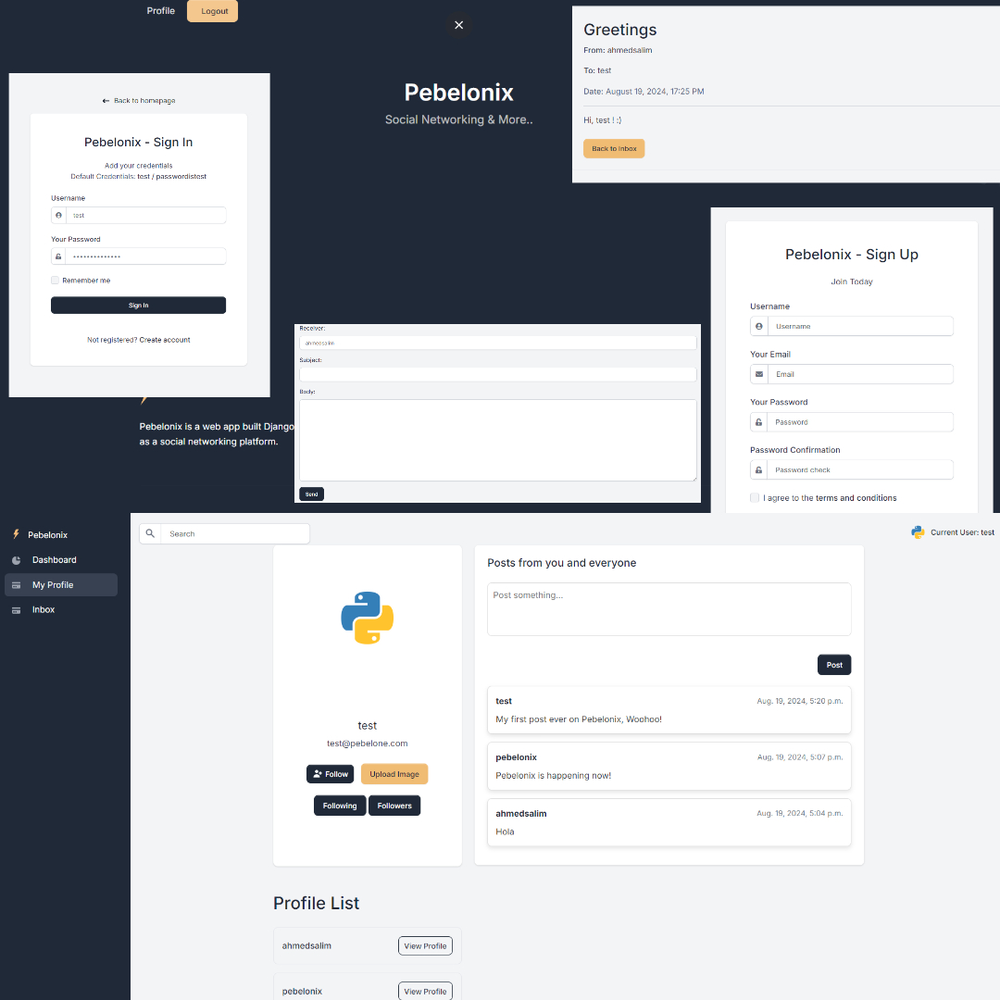

# Pebelonix Social Networking

Pebelonix is a simple social networking app built using Django that allows users to register, log in, create posts, and follow/unfollow other users. It serves as a foundation for a social platform with basic functionalities, including user authentication, posting, and following.

The frontend uses [Volt Bootstrap 5 Dashboard]((https://demo.themesberg.com/volt-pro/pages/dashboard/dashboard.html)), an open-source dashboard built with the latest version of Bootstrap 5, without jQuery. It leverages only vanilla JavaScript for all functionalities, including plugins, providing a modern and lightweight user interface.

The app is temporarily deployed on [PythonAnywhere](https://pebelone.pythonanywhere.com/) and aims to provide an interactive user experience with AI-powered chat on the dashboard in future updates.

AI integration will assist users by answering their queries. For instance, if a user forgets a picture they sent earlier via chat, the AI will locate the message and provide direct access to it.

<!--  -->


## Features

- User Registration and Login
- Create, Edit, and Delete Posts
- Follow and Unfollow Other Users
- Simple User Dashboard
- AI-Powered Chat (Upcoming Feature)

## Getting Started

To get a local copy up and running, follow these steps:

### Prerequisites

- Python 3.8+
- Django 3.2+
- Pip (Python package manager)
- Docker (optional, for containerization)

### Installation

1. Clone the Repository:

    ```bash
    git clone https://github.com/yourusername/pebelonix.git
    cd pebelonix
    ```

2. Create and Activate a Virtual Environment:

    ```bash
    python -m venv venv
    source venv/bin/activate  # On Windows use `venv\Scripts\activate`

    ```

3. Install the Required Packages:

    ```bash
    pip install -r requirements.txt
    ```

4. Apply Migrations:

    ```bash
    python manage.py migrate
    ```
5. Create a Superuser:

    ```bash
    python manage.py createsuperuser
    ```
6. Run the Server:
    ```bash
    python manage.py runserver
    ```
    Visit `http://127.0.0.1:8000/` to see the app in action.

### Running with Docker
If you prefer to run the application in a Docker container, use the following steps:

1. Build the Docker Image:
    ```bash
    docker-compose build
    ```

2. Run the Docker Container:

    ```bash
    docker-compose up
    ```

## Project Structure
The project has a well-organized structure following Django best practices:


```bash
.
├── core
│   ├── __init__.py
│   ├── asgi.py
│   ├── settings.py
│   ├── staticfiles
│   ├── urls.py
│   └── wsgi.py
├── apps
│   ├── authentication
│   │   ├── __init__.py
│   │   ├── admin.py
│   │   ├── forms.py
│   │   ├── migrations
│   │   ├── models.py
│   │   ├── urls.py
│   │   └── views.py
│   ├── home
│   │   ├── __init__.py
│   │   ├── admin.py
│   │   ├── forms.py
│   │   ├── models.py
│   │   ├── urls.py
│   │   └── views.py
│   ├── static
│   │   └── assets
│   └── templates
│       ├── accounts
│       ├── home
│       ├── includes
│       └── layouts
├── docker-compose.yml
├── Dockerfile
├── manage.py
├── requirements.txt
└── README.md

```

## Deployment

The application is temporarily deployed on PythonAnywhere. You can also deploy it on any platform that supports Django, such as Heroku, AWS, or Azure.


## Contact

_Ahmed Salim - realahmedsalim@gmail.com_

_I will be writing a blog or paper on this project once it is completed. However, please feel free to reach out if you have any questions, suggestions, or you would love to contribute!_
